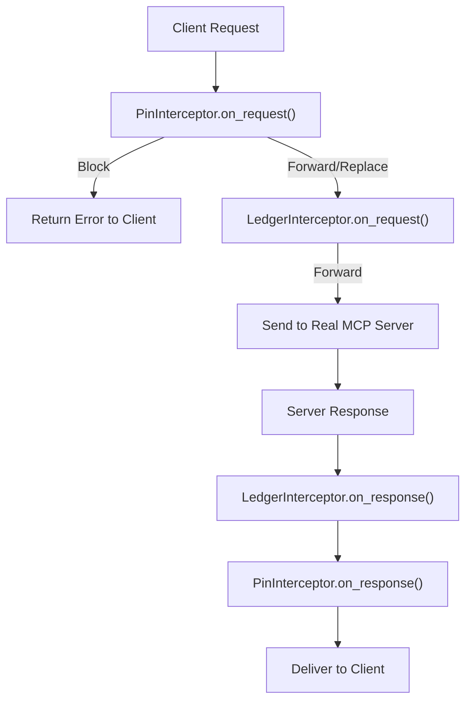
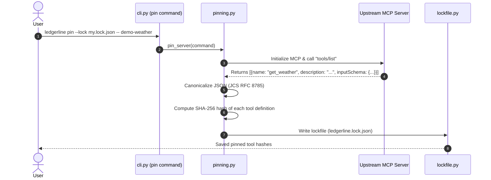
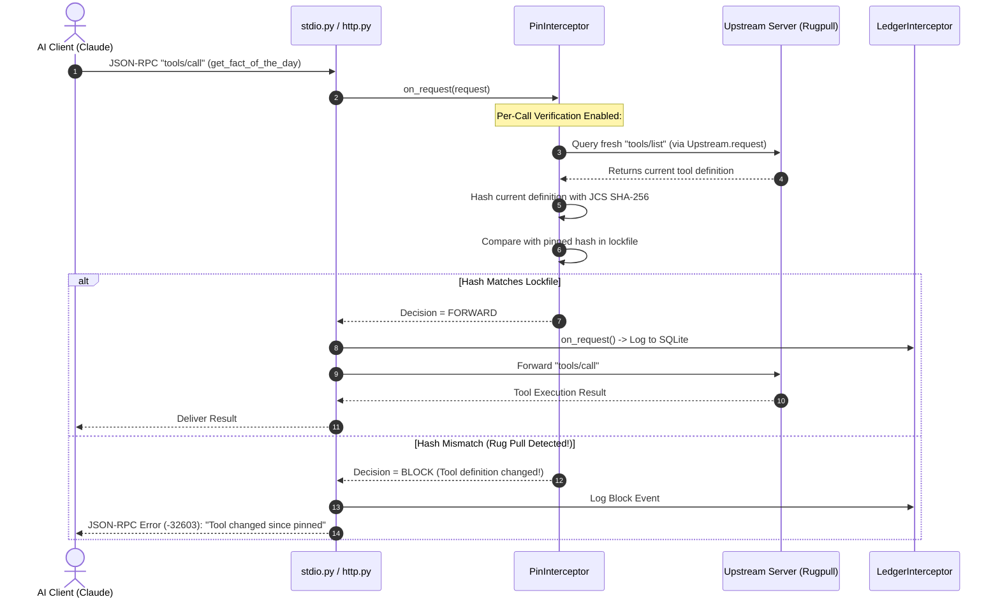

# Ledgerline Architecture, Flow & Code Logic Guide

This guide is an end-to-end walkthrough of the entire Ledgerline codebase. It is designed so that anyone—from a beginner to an experienced engineer—can understand how all the files, layers, interceptors, callbacks, and protocols connect together.

---

## 1. High-Level Vision & Core Purpose

### What Problem Does Ledgerline Solve?
When an AI agent (like Claude, ChatGPT, or Cursor) connects to an MCP (Model Context Protocol) server to execute tools:
1. **The Host Agent trusts whatever tool definitions the server returns.**
2. A malicious server can inject secret prompt instructions into tool descriptions (**Tool Poisoning**).
3. A compromised server can change a harmless tool into an attack payload mid-session (**Rug Pull**).
4. No independent, tamper-proof record exists to prove to an auditor what the agent requested, what the server returned, and what security policies were enforced.

```
┌─────────────────┐             ┌───────────────────────────────┐             ┌─────────────────────┐
│  AI Agent Host  │ ──────────► │     Ledgerline Proxy Layer    │ ──────────► │  Upstream MCP Server│
│ (Claude/Client) │ ◄────────── │ (Pinning + Ledger + Policies) │ ◄────────── │ (Tools, Data, APIs) │
└─────────────────┘             └───────────────────────────────┘             └─────────────────────┘
                                                │
                                                ▼
                                   ┌──────────────────────────┐
                                   │  Tamper-Evident Ledger   │
                                   │ (SQLite + Hash Chains)   │
                                   └──────────────────────────┘
```

---

## 2. Directory & Module Map

```
ledgerline/
├── src/ledgerline/
│   ├── cli.py                  # CLI Entrypoints (pin, proxy, ledger, sim, api)
│   ├── jsonrpc.py              # JSON-RPC 2.0 parser, encoder & message types
│   ├── wiretap.py              # Wiretap traffic recorder for test fixtures
│   │
│   ├── pin/                    # Tool Definition Pinning (Phase 2)
│   │   ├── canonical.py        # RFC 8785 JSON Canonicalization (JCS) & SHA-256
│   │   ├── lockfile.py         # Lockfile schema (ledgerline.lock.json)
│   │   ├── pinning.py          # Probes servers to generate/update lockfiles
│   │   └── interceptor.py      # PinInterceptor: Blocks rug pulls & unpinned tools
│   │
│   ├── proxy/                  # Core MCP Interception Engine
│   │   ├── interceptor.py      # Interceptor, Chain, Forward, Replace, Block protocols
│   │   ├── events.py           # Structured telemetry events (calls, blocks, alerts)
│   │   ├── stdio.py            # StdioProxy: Spawns subprocess & filters stdin/stdout
│   │   ├── http.py             # HttpProxy: Starlette ASGI proxy for Streamable HTTP
│   │   └── sse.py              # Server-Sent Events (SSE) framing & parsing
│   │
│   ├── ledger/                 # Tamper-Evident Audit Logging (Phase 3)
│   │   ├── schema.py           # Database models & event record structures
│   │   ├── hashing.py          # Cryptographic digest computation
│   │   ├── digest.py           # Payload canonicalization for hashing
│   │   ├── store.py            # SQLite database store & append-only log engine
│   │   ├── interceptor.py      # LedgerInterceptor: Records all traffic to SQLite
│   │   └── verify.py           # Offline cryptographic hash-chain verifier
│   │
│   ├── sim/                    # Security Benchmark & Attack Simulator
│   │   ├── runner.py           # Simulation engine (runs agent against attack scenarios)
│   │   ├── catalog.py          # Scenario catalog (poisoning, rugpull, unpinned tools)
│   │   ├── agent.py            # Simulated AI agent behaviors
│   │   └── coverage.py         # Security test coverage & metrics
│   │
│   ├── api/                    # Web Dashboard & Audit UI
│   │   ├── app.py              # FastAPI/Starlette REST API & Web UI server
│   │   └── security.py         # API authentication & session tokens
│   │
│   └── demo/                   # Built-in Demo Testbed
│       ├── common.py           # Shared demo helpers & uvicorn server runner
│       ├── client.py           # Interactive test client (`demo-client`)
│       └── servers/
│           ├── weather.py      # Honest baseline MCP server (`demo-weather`)
│           ├── poisoned.py     # Malicious prompt-injection server (`demo-poisoned`)
│           └── rugpull.py      # Malicious mutating server (`demo-rugpull`)
```

---

## 3. The Interceptor Chain Pattern (The Core Engine)

Every check in Ledgerline is implemented as an **`Interceptor`** ([`src/ledgerline/proxy/interceptor.py`](file:///Users/puneetshetty/App%20projects/ledgerline/src/ledgerline/proxy/interceptor.py)).

### The Decision Model
When a JSON-RPC message arrives, each interceptor returns one of three decisions:
* **`Forward()`**: Allow the message to proceed untouched.
* **`Replace(body)`**: Modify the message before sending it along.
* **`Block(response, reason)`**: Do not send the message to the target. Immediately reply to the caller with a JSON-RPC error.



### The Onion-Layer Execution:
In [`Chain._run()`](file:///Users/puneetshetty/App%20projects/ledgerline/src/ledgerline/proxy/interceptor.py#L108):
1. **Requests** pass through interceptors in order: `[PinInterceptor -> LedgerInterceptor]`.
2. **Responses** pass through interceptors in **reverse order**: `[LedgerInterceptor -> PinInterceptor]`.
3. If any interceptor returns `Block`, execution stops immediately and the error response is sent back.

---

## 4. End-to-End Execution Flows

### Flow 1: Tool Pinning (`ledgerline pin`)
Tool pinning creates a cryptographic fingerprint of all tools an MCP server provides.



---

### Flow 2: Live Proxy Request Interception (Blocking a Rug Pull)

Here is what happens when an agent tries to call a tool that silently mutated its description:



---

### Flow 3: Tamper-Evident Ledger Hashing

Every interaction is stored in an immutable append-only hash chain in SQLite ([`src/ledgerline/ledger/store.py`](file:///Users/puneetshetty/App%20projects/ledgerline/src/ledgerline/ledger/store.py)).

```
┌────────────────────────┐       ┌────────────────────────┐       ┌────────────────────────┐
│        Entry 1         │       │        Entry 2         │       │        Entry 3         │
├────────────────────────┤       ├────────────────────────┤       ├────────────────────────┤
│ Index: 1               │       │ Index: 2               │       │ Index: 3               │
│ Prev Hash: 0000000000  │       │ Prev Hash: Hash(Entry1)│       │ Prev Hash: Hash(Entry2)│
│ Payload: tools/list    │ ────► │ Payload: tools/call    │ ────► │ Payload: call_blocked  │
│ Hash: 8f4a2c...        │       │ Hash: 3b1e99...        │       │ Hash: d5c081...        │
└────────────────────────┘       └────────────────────────┘       └────────────────────────┘
```

If an attacker modifies or deletes any row in the database, `ledgerline ledger verify` recalculates all hashes and immediately detects the exact corrupted row.

---

## 5. Summary of Key Classes & Interfaces

| Class / Protocol | File Location | Responsibility |
| :--- | :--- | :--- |
| `Interceptor` | [`proxy/interceptor.py`](file:///Users/puneetshetty/App%20projects/ledgerline/src/ledgerline/proxy/interceptor.py) | Base interface defining `on_request`, `on_response`, and `observe`. |
| `Chain` | [`proxy/interceptor.py`](file:///Users/puneetshetty/App%20projects/ledgerline/src/ledgerline/proxy/interceptor.py) | Composes multiple interceptors into an onion-like pipeline. |
| `StdioProxy` | [`proxy/stdio.py`](file:///Users/puneetshetty/App%20projects/ledgerline/src/ledgerline/proxy/stdio.py) | Proxies JSON-RPC messages between stdin/stdout and a child process. |
| `HttpProxy` | [`proxy/http.py`](file:///Users/puneetshetty/App%20projects/ledgerline/src/ledgerline/proxy/http.py) | Starlette ASGI application proxying Streamable HTTP MCP traffic. |
| `PinInterceptor` | [`pin/interceptor.py`](file:///Users/puneetshetty/App%20projects/ledgerline/src/ledgerline/pin/interceptor.py) | Enforces lockfile tool pins and blocks definition changes. |
| `LedgerStore` | [`ledger/store.py`](file:///Users/puneetshetty/App%20projects/ledgerline/src/ledgerline/ledger/store.py) | SQLite-backed cryptographic hash chain repository. |
| `LedgerInterceptor` | [`ledger/interceptor.py`](file:///Users/puneetshetty/App%20projects/ledgerline/src/ledgerline/ledger/interceptor.py) | Records requests, responses, and proxy decisions to the ledger. |
| `SimRunner` | [`sim/runner.py`](file:///Users/puneetshetty/App%20projects/ledgerline/src/ledgerline/sim/runner.py) | Runs benchmark scenarios to test defenses against attacks. |
| `App` | [`api/app.py`](file:///Users/puneetshetty/App%20projects/ledgerline/src/ledgerline/api/app.py) | Web application providing REST endpoints and an audit dashboard. |
